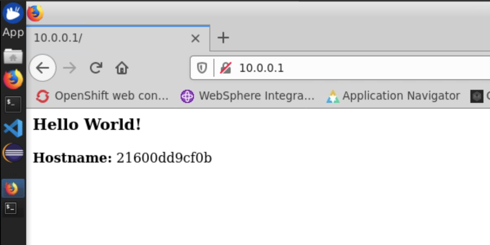

# Exercise 4 - Building a Customer Docker Image

In this exercise, you'll create a simple Python application image from source code built locally.

Use the resoures in the [python-image](resources/python-image) directory.

If you have cloned the entire `openshift-bootcamp` Git repo, change directory to `/home/ibmdemo/awb-bootcamp/openshift-bootcamp/Labs/Lab01-Building-a-container/resources/python-image`. If not, then visit the Git repository in the URL and copy the file contents directly into a new directory.

To build the image, run the following

```
$ docker build -t my-python .
```

The docker image should start building, and it will be available in the list of docker images

```
$ docker images my-python
REPOSITORY          TAG                 IMAGE ID            CREATED             SIZE
my-python           latest              44c13412dac4        47 seconds ago      131MB
```

We can now use this as a base image for a container deployment.

Deploy a new container from this image using exposing port 80 on the local machine. Note that if you did not clean up containers from previous exercises, you might get errors stating port 80 is still in use. Either remove the old container or choose a different port using the format `[HOSTPORT]:80`.

```
$ sudo docker run -d --name my-python -p 80:80 my-python:latest
```

The container should now be running at port 80, so check it by entering your local VM's IP address into a browser window. You should be presented with the 'Hello World' message, along with the hostname of the container.



Stop and remove the `my-python` container

```
$ docker rm $(docker stop my-python)
```

As the Docker image was built from the Dockerfile that used an environment variable, we can customise this when running the container.

For example, use the `NAME` variable to post a different message

```
$ sudo docker run -d --name my-python -p 80:80 -e NAME='Everybody' my-python:latest
```

Refresh the browser, the response should have changed.

Lab complete.