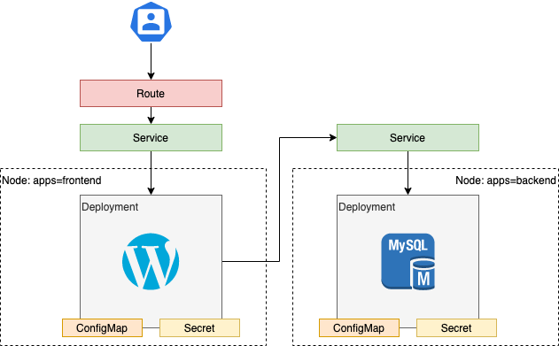

# Exercise 1 - Creating a Wordpress Application in OpenShift

In this lab, you'll create a Wordpress application that uses a MySQL back end deployment. We've already seen how to create and expose a simple 1 tier deployment, so now we're extending this to a 2 tier Wordpress and MySQL application. There will be minimal guidance in this exercise, as it is designed to test your knowledge thus far.

To get started, log into OpenShift using the CLI, as described [here](../Getting-started/log-in-to-openshift.md).

A set of helpful common `oc` commands can be found [here](../Getting-started/oc-commands.md).

Once you're logged in, create a new project for this deployment.

```
$ oc new-project userXX-lab03-wp-sql
```

Replace `userXX` with your user ID or other name.

Create a new local directory for this lab, and change to it.

```
$ mkdir -p Lab02/mariadb
$ cd Lab02/mariadb
```

The overall design looks as follows



To get started, you can use the following base deployment specifications.

Wordpress
```
apiVersion: apps/v1
kind: Deployment
metadata:
  name: wordpress
  labels:
    app: wordpress
spec:
  selector:
    matchLabels:
      app: wordpress
      tier: frontend
  strategy:
    type: Recreate
  template:
    metadata:
      labels:
        app: wordpress
        tier: frontend
    spec:
      containers:
      - image: wordpress:4.8-apache
        name: wordpress
        ports:
        - containerPort: 80
          name: wordpress
        volumeMounts:
        - name: wordpress-persistent-storage
          mountPath: /var/www/html
      volumes:
      - name: wordpress-persistent-storage
        emptyDir: {}
```

MySQL
```
apiVersion: apps/v1
kind: Deployment
metadata:
  name: wordpress-mysql
  labels:
    app: wordpress
spec:
  selector:
    matchLabels:
      app: wordpress
      tier: mysql
  strategy:
    type: Recreate
  template:
    metadata:
      labels:
        app: wordpress
        tier: mysql
    spec:
      containers:
      - image: mysql:5.6
        name: mysql
        env:
        ports:
        - containerPort: 3306
          name: mysql
        volumeMounts:
        - name: mysql-persistent-storage
          mountPath: /var/lib/mysql
      volumes:
      - name: mysql-persistent-storage
        emptyDir: {}
```

Use the following specifications for your application

Use a ConfigMap to store the following environment variables
- `WORDPRESS_DB_HOST` for the name of the MySQL Service
- `MYSQL_USER` for the MySQL user name
- `MYSQL_DATABASE` for the MySQL database 

Use a Secret to store the following sensitive information
- `WORDPRESS_DB_PASSWORD` for the Wordpress database password
- `MYSQL_PASSWORD` for the MySQL user password specified in `MYSQL_USER`
- `MYSQL_ROOT_PASSWORD` for the MySQL root user password
  
Use the following resource requests and limits

| | WordPress | MySQL |
|-| ---|---|
| CPU request | 100m | 100m |
| CPU limit | 200m | 200m |
| Memory request | 128Mi | 256Mi |
| Memory limit | 256Mi | 256Mi |

Add a nodeSelector to the Wordpress front end to target nodes labelled "apps=frontend"
Add a nodeSelector to the MySQL back end to target nodes labelled "apps=backend"

Expose the Wordpress front end.

Create a new route for the wordpress service only.

You'll need to create a few ConfigMaps and secrets, then add them to these deployment files as we did in Lab02.

Once your files are ready to deploy to OpenShift, you can use `oc create -f <filename>` to deploy it within your project.

When finished, remove all of the resources you created and the project.

Lab complete.