# Exercise 1 - Building Applications with Appsody Stacks and Tekton Pipelines

In this lab you will create simple "Hello, World!" application based on  a nodejs express appsody stack. You will utilise a Tekton pipeline to deploy the application into your OpenShift cluster.

To get started, log into OpenShift using the CLI, as described [here](../Getting-started/log-in-to-openshift.md).

A set of helpful common `oc` commands can be found [here](../Getting-started/oc-commands.md).

Once you're logged in, create a new project for this deployment.

```
$ oc new-project userXX-lab13-appsody
```

Replace `userXX` with your user ID or other name.

This lab is split into two parts

Part 1 - Use Appsody to build and deploy an application using Kabanero stacks

Part 2 - Push your Appsody application to GitHub and create a Tekton pipeline to automatically build the application from source code

# Part 1 - Using Appsody to Deploy an Application

Open the Cloud pak for Applications Landing page and head to the **Instances** overview by opening the overview in the left upper corner.
Under **stacks**, copy the URL into your clipboard. 

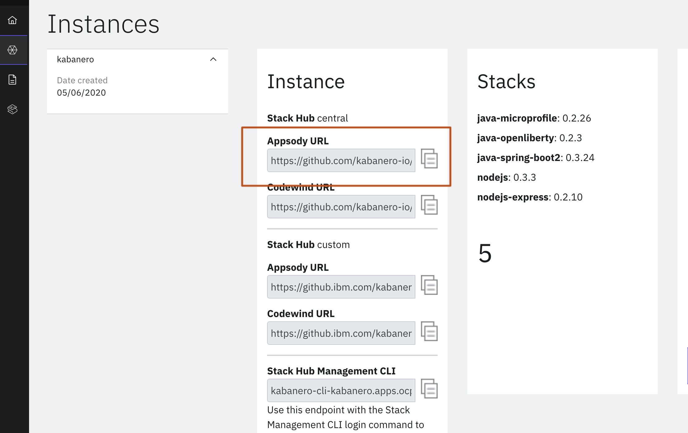

Open a terminal window and run the following command:
```
$ appsody repo list
NAME            URL
*incubator  	https://github.com/appsody/stacks/releases/latest/download/incubator-index.yaml                        
experimental	https://github.com/appsody/stacks/releases/latest/download/experimental-index.yaml 
```

This will list a default list of repositories from which you can pull stack images from. When you install **appsody** you will be provided with two repos to get started with.   
Add the repository from your CP4Apps landing page by running the following command:
```
$ appsody repo add kabanero https://github.com/kabanero-io/kabanero-stack-hub/releases/download/0.6.3/kabanero-stack-hub-index.yaml
```
You can list available stack images in the newly added repository:
```
$ appsody list kabanero
REPO    	ID               	VERSION  	TEMPLATES        	DESCRIPTION                                              
kabanero	java-microprofile	0.2.26   	*default         	Eclipse MicroProfile on Open Liberty & OpenJ9 using Maven
kabanero	java-openliberty 	0.2.3    	*default         	Open Liberty & OpenJ9 using Maven                        
kabanero	java-spring-boot2	0.3.24   	*default, kotlin 	Spring Boot using OpenJ9 and Maven                       
kabanero	nodejs           	0.3.3    	*simple          	Runtime for Node.js applications                         
kabanero	nodejs-express   	0.2.10   	scaffold, *simple	Express web framework for Node.js
```
Create a new directory in which you want to start your Apssody project. 
```
$ mkdir appsody
$ cd appsody
```

Initialise your project with the nodejs express stack:
```
$ appsody init kabanero/nodejs-express
```

This command will select the nodejs-express stack images from the kabanero repository and pull it to your local environment.  By default, the command creates an Appsody stack configuration file and provides a simple default application. The structure and content of the stack template depends on the choices made by the stack architect. 

Open the directory in your IDE environment. In this lab we will be using Microsoft Visual Studio Code. You can open VS Code directly from the terminal by running **code .** in your project directory. 

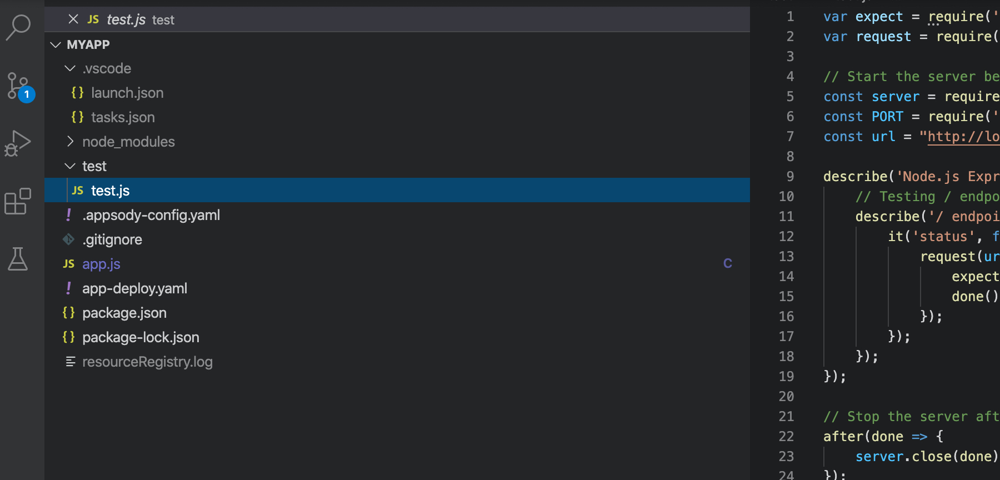


Ensure that you open the terminal view (View>Terminal)
Start the continuous development environment in the terminal window. Make sure that you run the following command within your project directory.
```
$ appsody run
```

This runs the express application inside a docker container with the cloud-native nodejs app added. You can now access the application in your browser. Paste the following URL into a new browser tab:
```
https://localhost:3000
```

Locate the *app.js* file in your project directory.
Make a code change by adding a second exclamation mark at the end of **"Hello from Appsody!"**
Notice how the code changes initiate appsody to restart the container in the terminal window.

The stack template provides a couple of endpoints for the application to serve traffic in a Kubernetes based environment. The following endpoints can be accessed while your container is running.

- Readiness endpoint: [](http://localhost:3000)/ready
- Liveness endpoint: http://localhost:3000/live
- Health check endpoint: http://localhost:3000/health
- Metrics endpoint: http://localhost:3000/metrics

After you implemented your code changes, run the following command to build your final application image:
```
$ appsody build
```

This will create a new application image including the stack technologies along with any customised code. In addition, this will also build an **app-deploy.yaml** file that you can locate in the content tree of the editor. This builds the application into a deployment-file that is recognisable by the appsody operator running inside the OpenShift cluster.

From here, you could actually push this application to OpenShift as it is. First we need to log into the OpenShift Image Registry using Docker. Replace `userXX` with your own user ID.

```
$ docker login default-route-openshift-image-registry.apps.demo.ibmdte.net/userXX-lab13-appsody -u $(oc whoami) -p $(oc whoami -t)
Login Succeeded
```

You can do this by running the following (replace `userXX` with your own user ID.)
```
$ appsody deploy --tag userXX-lab13-appsody/nodejs-demo:v1 --push-url default-route-openshift-image-registry.apps.demo.ibmdte.net --push --pull-url image-registry.openshift-image-registry.svc.cluster.local:5000 --namespace userXX-lab13-appsody
```

This will deploy the NodeJS application to OpenShift. You can view the status of the pods by using `oc get pods`.

You can also view the generated AppsodyApplication resource type by navigating to Operators > Installed Operators > Appsody Operator > AppsodyApplication.

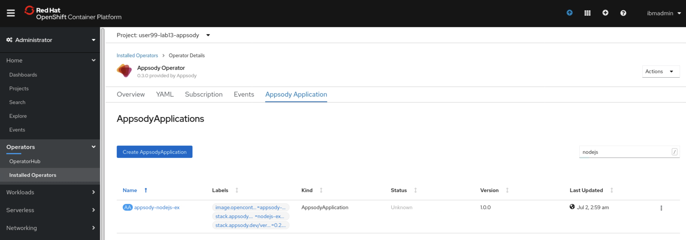

After you created your deployment manifest, you can then push your application code to Github.

For this step, you'll need to create a GitHub account, if you don't aleady have one. If you need to create one, you can follow the steps [here](../Getting-started/Creating-a-github-account.md).

Create a new repository called `appsody-nodejs-express` and copy the repository URL given to you when you create it.

In the project directory run the following commands to push the code artefacts to your repository
```
$ git init
$ git add .
$ git commit -m "first commit"
$ git remote add origin $GITHUB_REPOSITORY_URL
$ git push -u origin master
```
Go back to your Github account and ensure the contents of the project directory have been published in your recently created repository.

In the terminal, create a new file called `pipeline.yaml` with the following contents

```
apiVersion: tekton.dev/v1alpha1
kind: Pipeline
metadata:
  name: appsody-build-pipeline
spec:
  resources:
    - name: git-source
      type: git
    - name: docker-image
      type: image
  tasks:
    - name: appsody-build
      taskRef:
        name: appsody-build-push-deploy-task
      resources:
        inputs:
        - name: git-source
          resource: git-source
        - name: docker-image
          resource: docker-image
      params:
      - name: app-deploy-file-name
        value: app-deploy.yaml
```

Create the Pipeline resource
```
$ oc create -f pipeline.yaml
pipeline.tekton.dev/appsody-build-pipeline created
```

Create a new Task. Create a new file called `build-push-deploy-task.yaml` with the following contents 

```
apiVersion: tekton.dev/v1alpha1
kind: Task
metadata:
  name: appsody-build-push-deploy-task
spec:
  inputs:
    resources:
      - name: git-source
        type: git
      - name: docker-image
        type: image
    params:
      - name: app-deploy-file-name
        default: app-deploy.yaml
  steps:
    - name: build
      securityContext:
        privileged: true
      image: appsody/appsody-buildah:0.5.3-buildah1.9.0
      command: ['/bin/bash']
      args:
        - -c
        - "cd /workspace/$gitsource && appsody build -v --buildah --buildah-options='--format=docker' -t $(inputs.resources.docker-image.url) -f $(inputs.params.app-deploy-file-name)"
      env:
        - name: gitsource
          value: git-source
      volumeMounts:
        - mountPath: /var/lib/containers
          name: varlibcontainers
    - name: push
      securityContext:
        privileged: true
      image: appsody/appsody-buildah:0.5.3-buildah1.9.0
      command: ['buildah', 'push', '--tls-verify=false', '$(inputs.resources.docker-image.url)', 'docker://$(inputs.resources.docker-image.url)']
      serviceAccount: appsody-sa
      volumeMounts:
         - mountPath: /var/lib/containers
           name: varlibcontainers
    - name: deploy-image
      image: kabanero/kabanero-utils
      command: ['/bin/sh']
      args: ['-c', 'cd /workspace/$gitsource && kubectl apply -f $(YAMLFILE)']
      env:
        - name: gitsource
          value: git-source
        - name: YAMLFILE
          value: $(inputs.params.app-deploy-file-name)
  volumes:
    - name: varlibcontainers
      emptyDir: {}
```

Create the Task
```
$ oc create -f build-push-deploy-task.yaml
task.tekton.dev/appsody-build-push-deploy-task created
```

Retrieve the secret names that contain **dockercfg**:

```
$ oc get secrets | grep dockercfg
appsody-sa-dockercfg-z68jp                 kubernetes.io/dockercfg               1      19m
builder-dockercfg-7mqqv                    kubernetes.io/dockercfg               1      12h
default-dockercfg-558dr                    kubernetes.io/dockercfg               1      12h
deployer-dockercfg-c7cqz                   kubernetes.io/dockercfg               1      12h
pipeline-dockercfg-9zzlp                   kubernetes.io/dockercfg               1      12h
```

You'll need to use the `default-dockercfg-xxxx` for the `secrets.name`, and the `builder-dockercfg-xxxx` in the `imagePullSecrets.name` sections of the ServiceAccount.

Specify the following service account which will implement the pipelinerun. Create a file called `appsody-sa.yaml` with the following contents, replacing `default-dockercfg-9scx6` and `builder-dockercfg-k5btj` with the names of the secret retrieved in the previous step.
``
apiVersion: v1
kind: ServiceAccount
metadata:
  name: appsody-sa 
secrets:
- name: default-dockercfg-558dr
imagePullSecrets:
- name: builder-dockercfg-7mqqv
``

Create the Service Account
```
$ oc create -f appsody-sa.yaml
serviceaccount/appsody-sa created
```

Run the following commands to enable the right privileges for the pipeline

```
$ oc adm policy add-cluster-role-to-user cluster-admin -z appsody-sa
$ oc adm policy add-role-to-user system:image-builder -z appsody-sa
$ oc adm policy add-role-to-user edit -z appsody-sa
```

The Pipeline requires storage during each staged event, so if we do not have any default storage class that provides dynamic storage, we should create this now. In this lab, we have dynamic storage, but we can create a Persistent Volume Claim anyway

```
apiVersion: v1
kind: PersistentVolumeClaim
metadata:
  name: appsody-manual-pipeline-run-pvc
spec:
  accessModes:
  - ReadWriteOnce
  storageClassName: "managed-nfs-storage"
  volumeMode: Filesystem
  resources:
    requests:
      storage: 1Gi
```

The pipeline will interact with various pipelineresources. The image will be built based on the code that you previously developed and pushed to your git repository. Once the pipeline built the image, it will store it in the internal Openshift image repository.

Create a new file called `pipeline-resource.yaml` for the PipelineResource. Before you create the resource, ensure that you replace $GITHUB_REPOSITORY_URL with the Github URL that hosts the nodejs application that you created in the first part of the lab, and replace $PROJECT with your project name

```
apiVersion: v1
items:
- apiVersion: tekton.dev/v1alpha1
  kind: PipelineResource
  metadata:
    name: docker-image
  spec:
    params:
    - name: url
      value: image-registry.openshift-image-registry.svc:5000/$PROJECT/appsody-nodejs-lab
    type: image
- apiVersion: tekton.dev/v1alpha1
  kind: PipelineResource
  metadata:
    name: git-source
  spec:
    params:
    - name: revision
      value: master
    - name: url
      value: $GITHUB_REPOSITORY_URL
    type: git
kind: List
```

Create the PipelineResource
```
$ oc create -f pipeline-resource.yaml
pipelineresource.tekton.dev/docker-image created
pipelineresource.tekton.dev/git-source created
```

Before you initate the pipelinerun, you have to adjust the `appsody-deploy.yaml` in your Github repository to reflect the namespace that you want to deploy your application to. Edit the file either in your browser (if you're logged in to GitHub) or via the CLI, then commit your changes.

```
$ git add .
$ git commit -m "updated appsody-deploy.yaml"
$ git push -u origin master
```

Now that the code is ready in GitHub, we can execute a PipelineRun. Create a file called `pipeline-run.yaml` with the following content

```
apiVersion: tekton.dev/v1alpha1
kind: PipelineRun
metadata:
  name: appsody-manual-pipeline-run
spec:
  serviceAccountName: appsody-sa
  timeout: "1h0m0s"  
  pipelineRef:
    name: appsody-build-pipeline
  resources:
    - name: git-source
      resourceRef:
        name: git-source
    - name: docker-image
      resourceRef:
        name: docker-image
```

Create the PipelineRun

```
$ oc create -f pipeline-run.yaml
pipelinerun.tekton.dev/appsody-manual-pipeline-run created
```

From the CP4Apps instances landing page, head to the **pipelines overview**:

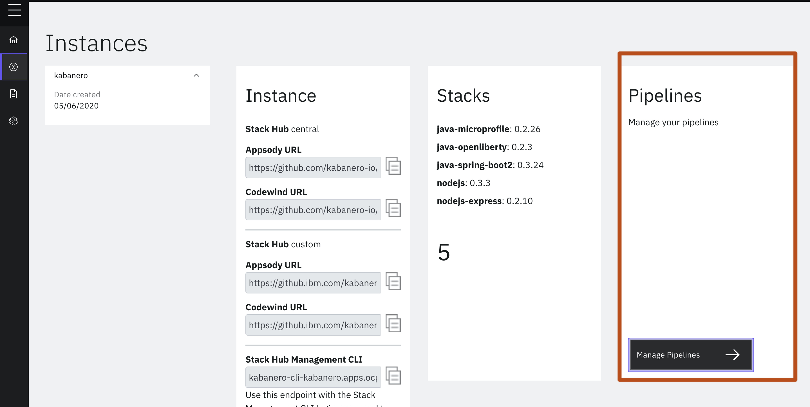

In the Tekton view, set the adequate filter for your namespace and open the **pipelinerun** view:

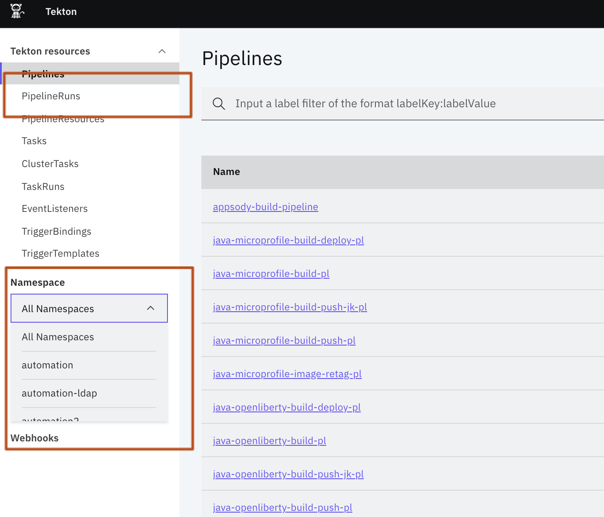

We should see the Pipeline resource created for our project

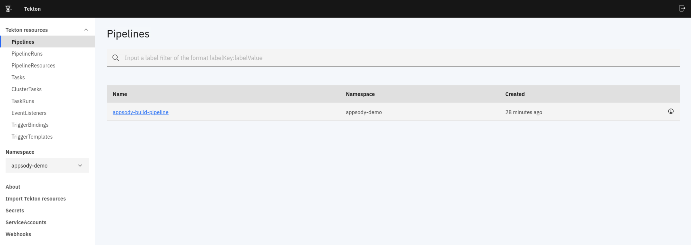

We can also see the PipelineRun running

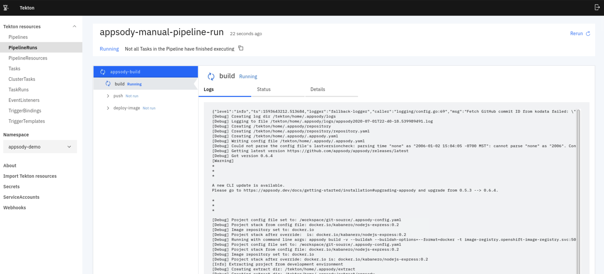

Follow along the progress of the pipelinerun through the log messages. In the Details section you can find more information including the pipelineresources and the scripts that each step in the pipeline passes through.

The pipelinerun takes about a little time to finish. You can identify a successful pipelinerun if every task in the pipeline has finished

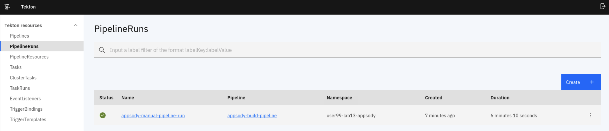

Inspect the logs of each task to gain some additional insight into the code that each step is running

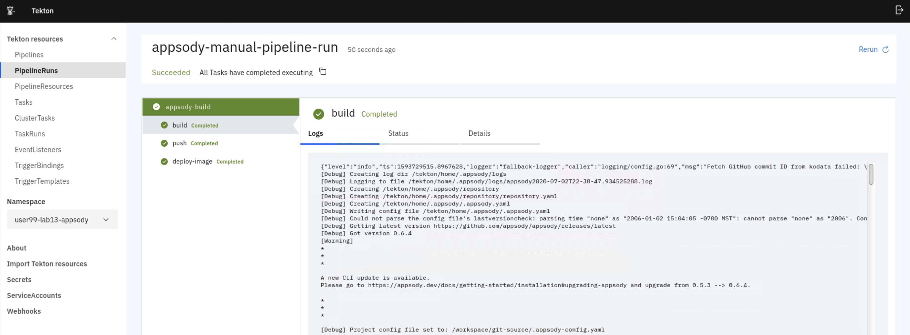

You can also inspect the pods that have run as a result of this pipeline

```
$ oc get pods
NAME                                                        READY   STATUS      RESTARTS   AGE
appsody-b949b4945-6h9jd                                     1/1     Running     0          2m13s
appsody-manual-pipeline-run-appsody-build-5msc9-pod-75zgq   0/4     Completed   0          8m23s
```

Head back to the main OpenShift console to locate the nodejs application that results from the pipelinerun. You can click on the application logo to get more information about the application. If you hover over the small arrow symbol you can directly access the application endpoint that is exposed via an OpenShift route. Also notice from the data overview that the same port are exposed as you run in the container within your local development environment.

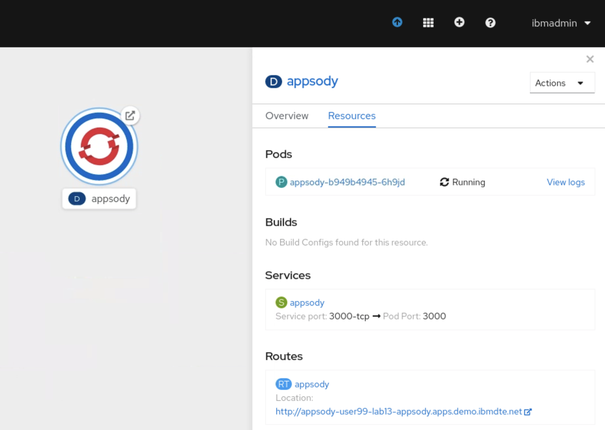

We can open the Route URL to check the application works

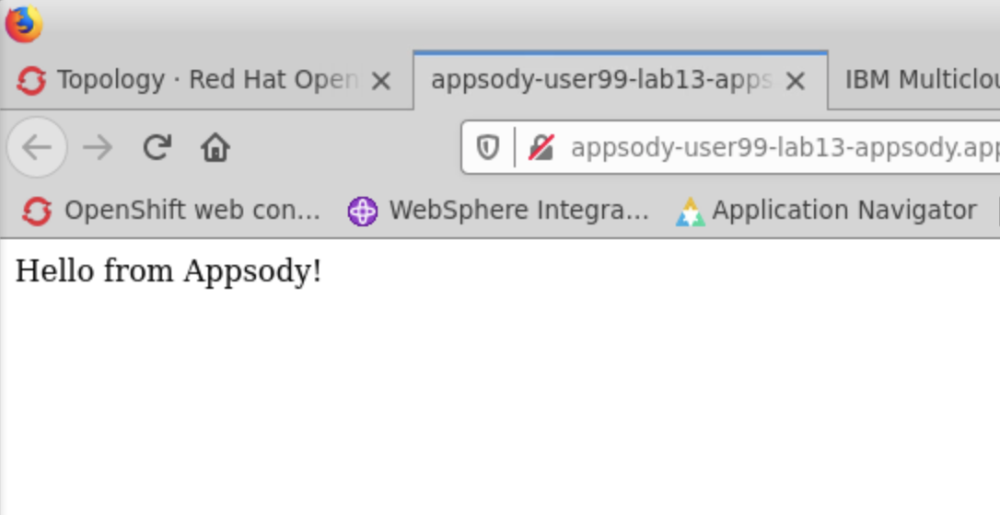

Notice that the application is of kind AppsodyApplication. This provides the API for the AppsodyOperator running inside the cluster to handle the lifecyclemanagement of your application.

Head to the Administrator view and navigate to Operators > Installed Operators. Choose the Appsody Operator to check which applications it manages. We should be able to see our deployed application here in the project created for this lab.

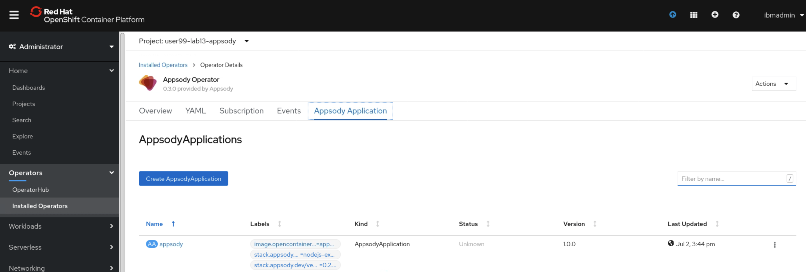

Lab complete. When finished, please clean up the created resources and delete the project.